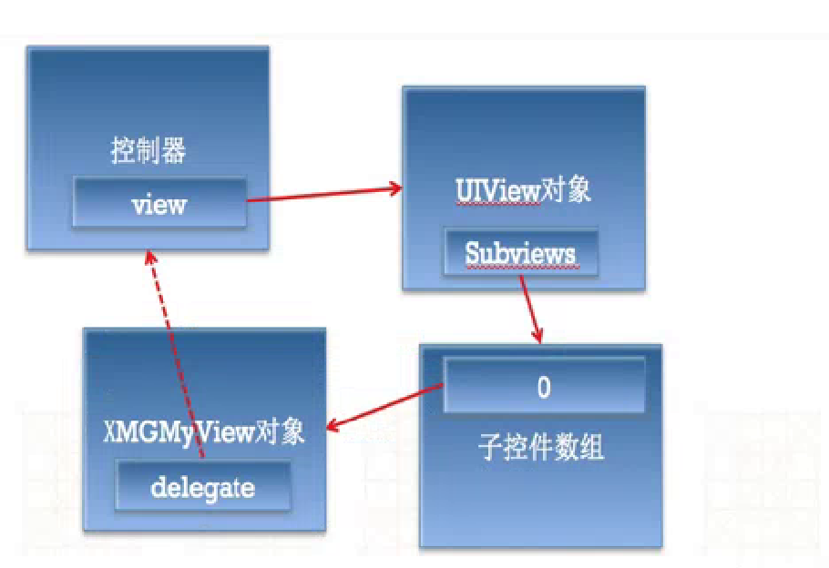

# UIScrollView

## 注�点
1. 如�UIScrollView无法滚动，�能是以下�因：

    � 没有设置contentSize

    � scrollEnabled = NO

    � 没有�收到触摸事件:userInteractionEnabled = NO ...

2. 在UIScrollView显示滚动�的情况下，��使用
scrollView.subviews[i]�访问��件，因为数组的索引会因为两个滚动���件改�。如�scrollView�是通过storyboard�xib创  建，那么一开始的subviews里�没有��件。

3. **如�没有滚动�，必�的�，�以使用scrollView.subviews[i]�访问��件**

4.
ContentOffset :
是内容区域相对�显示区域(UIScrollView的frame)的�移�
�移�= 显示区域 - 内容左上角 的 差值
contentInset :
是��内容的周边�加内边�,contentInset�影���的
ContentOffset和contentSize的计算

5. ### `(1)设置代�方法`

```objc
@interface ViewController ()  <UIScrollViewDelegate>
// 1. 类扩展中设置��循的代�
// 注�：自定义类�能被包�.m文件，所以代�放.h中
@end
```

### `(2)设置�循代�的对象`
```objc
@implementation ViewController
- (void)viewDidLoad {
    [super viewDidLoad];
    scrollView.delegate = self;  //
// @property (nonatomic, assign) id <UICollectionViewDelegate> delegate;
// delegate为弱引用，所以�边的赋值对象�为强引用（�则对象很快被销�）,一般让�制器�代�.
}
@end
```
### `delegate为弱引用的�因`


#### 代�使用的一般规律
- 作用：用�监��件的�些行为
- 代�：是�制器对象
- 代�：是id类�，并且是弱指针
- 代��议的格�：�件类�Delegate，比如UIScrollViewDelegate�UITextFieldDelegate
- 代�方法：方法�一般是�件�开头，比如UIScrollView的代�方法一般以scrollView开头

#### 如何监��件的行为
- 通过addTarget:
    - �有继承自UIControl的�件，�有这个功能
    - UIControlEventTouchUpInside : 点击事件（UIButton）
    - UIControlEventValueChanged : 值改�事件 （UISwitch�UISegmentControl�UISlider）
    - UIControlEventEditingChanged : 文字改�事件（UITextField）
- 通过delegate
    - �有拥有delegate�性的�件，�有这个功能


### `(3)��代�的方法`
#### < UIScrollViewDelegate >  代�方法
```objc
// ��scrollView在滚动，就会调用这个方法（监�scrollView的滚动）
- (void)scrollViewDidScroll:(UIScrollView *)scrollView

// 用户�将开始拖拽scrollView，就会调用这个方法调用这个方法
- (void)scrollViewWillBeginDragging:(UIScrollView *)scrollViewí¸‚w
// 用户�将�止拖拽scrollView，就会调用这个方法
- (void)scrollViewWillEndDragging:(UIScrollView *)scrollView withVelocity:(CGPoint)velocity targetContentOffset:(inout CGPoint *)targetContentOffset

// 用户已��止拖拽scrollView，就会调用这个方法
- (void)scrollViewDidEndDragging:(UIScrollView *)scrollView willDecelerate:(BOOL)decelerate
{
    if (decelerate == NO) {
        NSLog(@"scrollView�止滚动，完全�止");
    } else {
        NSLog(@"用户�止拖拽，但是scrollView由�惯性，会继续滚动，并且�速");
    }
}

// scrollView已��止�速，就会调用这个方法（�止滚动）
- (void)scrollViewDidEndDecelerating:(UIScrollView *)scrollView
{
    NSLog(@"scrollView�速完毕，�止滚动，完全�止");
}
```
### `代�的图�缩放方法`
```objc
- (UIView *)viewForZoomingInScrollView:(UIScrollView *)scrollView;     // 返�一个�被缩放的对象 if delegate returns nil, nothing happens

- (void)scrollViewWillBeginZooming:(UIScrollView *)scrollView withView:(UIView *)view  // called before the scroll view begins zooming its content

- (void)scrollViewDidEndZooming:(UIScrollView *)scrollView withView:(UIView *)view atScale:(CGFloat)scale; // scale between minimum and maximum. called after any 'bounce' animations

- (BOOL)scrollViewShouldScrollToTop:(UIScrollView *)scrollView;   // return a yes if you want to scroll to the top. if not defined, assumes YES

- (void)scrollViewDidScrollToTop:(UIScrollView *)scrollView;
```
###范例
```objc
@property (weak, nonatomic) IBOutlet UIScrollView *scrollView;

- (void)viewDidLoad   {
[super viewDidLoad];

// 设置滚动范围 一般设置为内容�件的size
self.scrollView.contentSize = imageView.frame.size;

// 设置内边�（在��内容的周边，�加内边�）
// contentInset �会影� contentOffset
self.scrollView.contentInset = UIEdgeInsetsMake(10, 20, 40, 80);
} //viewDidLoad 结�

/**
 *  点击了�制器的view，就会自动调用这个方法
 */
- (void)touchesBegan:(NSSet *)touches withEvent:(UIEvent *)event
{
# ContentOffset == UIScrollView的左上角 - contentSize的左上角
//    [self.scrollView setContentOffset:CGPointMake(-100, -200) animated:YES];
//    [self.scrollView setContentOffset:CGPointMake(350, 350) animated:YES];
}


- (void)test {
    // 是�有弹簧效� (范围超过contentSize时的弹簧效�)
    //    self.scrollView.bounces = NO;

    // �管有没有contentSize，都能拥有弹簧效�(一般适用�下拉刷新功能，上拉刷新)
    // 主�用在bounces=YES且没有设置contentSize时
    self.scrollView.alwaysBounceVertical = YES;
    self.scrollView.alwaysBounceHorizontal = YES;

    // 是��显示滚动�
    self.scrollView.showsHorizontalScrollIndicator = NO;
    self.scrollView.showsVerticalScrollIndicator = NO;
    self.scrollView.indicatorStyle = UIScrollViewIndicatorStyleDefault;

    // 设置滚动�的显示�格
    self.scrollView.indicatorStyle = UIScrollViewIndicatorStyleWhite;

    [[self.scrollView.subviews firstObject] removeFromSuperview]; //
}

- (IBAction)top {
     [UIView animateWithDuration:1.0 animations:^{
     //CGPoint offset = self.scrollView.contentOffset;
     //offset.y = 0;
     //self.scrollView.contentOffset = offset;

     self.scrollView.contentOffset = CGPointMake(self.scrollView.contentOffset.x, 0);
     }];

    // [self.scrollView setContentOffset:CGPointMake(self.scrollView.contentOffset.x, 0) animated:YES];
}

- (IBAction)bottom {
    CGFloat offsetY = self.scrollView.contentSize.height - self.scrollView.frame.size.height;
    CGFloat offsetX = self.scrollView.contentOffset.x;
    CGPoint offset = CGPointMake(offsetX, offsetY);
    [self.scrollView setContentOffset:offset animated:YES];
}

- (IBAction)left {
    [self.scrollView setContentOffset:CGPointMake(0, self.scrollView.contentOffset.y) animated:YES];
}

- (IBAction)right {
    CGFloat offsetX = self.scrollView.contentSize.width - self.scrollView.frame.size.width;
    CGFloat offsetY = self.scrollView.contentOffset.y;
    CGPoint offset = CGPointMake(offsetX, offsetY);
    [self.scrollView setContentOffset:offset animated:YES];
}

- (IBAction)rightTop {
    CGFloat offsetX = self.scrollView.contentSize.width - self.scrollView.frame.size.width;
    CGFloat offsetY = 0;
    CGPoint offset = CGPointMake(offsetX, offsetY);
    [self.scrollView setContentOffset:offset animated:YES];
}

- (IBAction)leftBottom {
    CGFloat offsetX = 0;
    CGFloat offsetY = self.scrollView.contentSize.height - self.scrollView.frame.size.height;
    CGPoint offset = CGPointMake(offsetX, offsetY);
    [self.scrollView setContentOffset:offset animated:YES];
}
```


